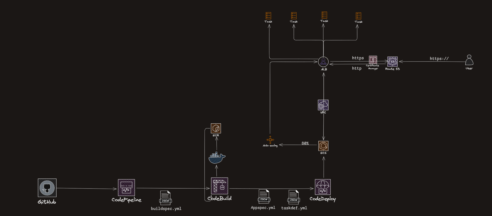

### Raffael Pimentel Ribeiro

Backend sênior (Node.js). Penso cloud-first na AWS: arquitetura, entrega e operação.

---

### Agora
- **[LeetCode](link)** — algoritmo + estrutura de dados
- **[System Design](link)** — estudos e desenhos de produção

---

### System Design: CI/CD em produção (AWS)
Pipeline que uso atualmente (blue/green, IaC com CloudFormation):

  

---

- LinkedIn: [www.linkedin.com/in/raffael-pimentel-backend-senior](https://www.linkedin.com/in/raffael-pimentel-backend-senior)
- Email: <rafaelribeirosousa013@gmail.com>
